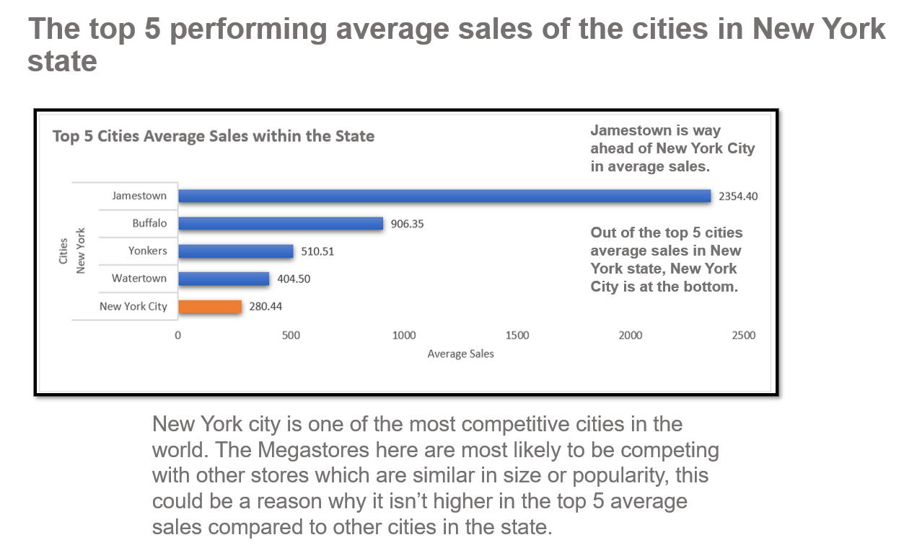
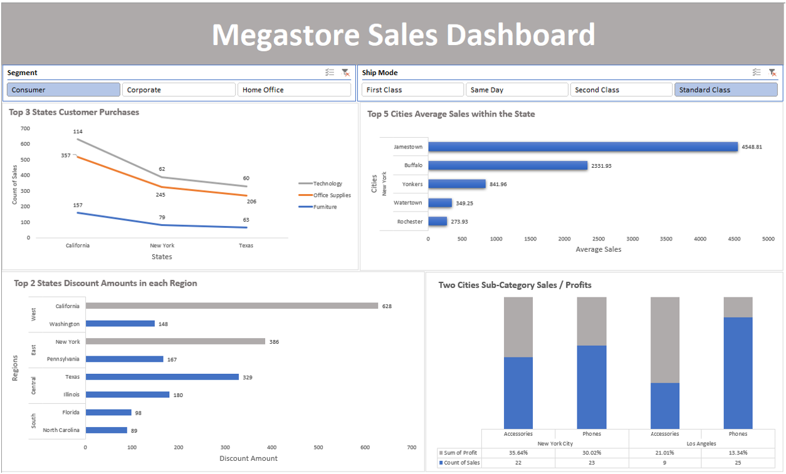

# MegastoreSales
## Megastore Sales Dashboard 
 

### Megastore sales interactive dashboard where you can filter segments e.g. consumer, corporate or home office. You can also filter by ship mode to view how customers got their items delivered to them. The ship mode options are first class, same day, second class and standard class.

### In this report the focus will be on the Megastore company mainly their stores in state of New York. 

I will compare: 

<li>The top performing average sales of the cities in New York state.  
<li>Top 3 States Customers Purchases. 
<li>Top 2 States Discount Amount in each Region.
<li>Two Cities Sub-Category Sales/ Profits these cities will be New York and Los Angeles. 

Software Used: Microsoft Excel

Charts Used: Bar Chart x2, Line Chart and Stacked Column Chart. 

 
  
 
  
 
 
 

  
## Dashboard filter settings with segment consumer filter & ship mode standard class filter
 
  
### When it comes to consumers that order their items by standard class shipping, New York City drops out of the top 5 best performing cities with average sales in the state of New York. However it has better profits with it’s accessories 35.64% which is more compared to Los Angeles with an accessories profit of 13.34%. 
  
## Summary
  
### In this report I compared: 

<li>The top performing average sales of the cities in New York state.  
<li>Top 3 States Customers Purchases. 
<li>Top 2 States Discount Amount in each Region.
<li>Two Cities Sub-Category Sales/ Profits these cities were New York and Los Angeles. 

New York state Megastores are performing well compared to other store in different states. One improvement I suggest is to get New York City to perform better when it comes to the top 5 average sales. Currently it’s number 5 overall but lets get this city into the top 2 when it comes to average sales in this state. We can increase the promotion of the stores in New York City; by improving Megastore’s social media presence because with New York City you will have to constantly keep the attention of the consumers here. There are many companies and independent stores that sell similar items in New York City. 

