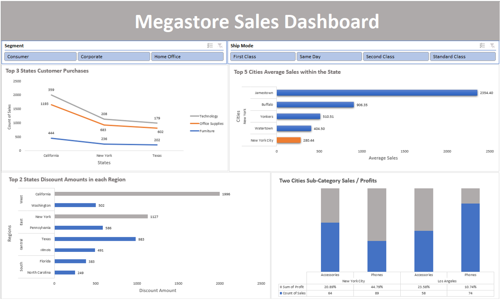
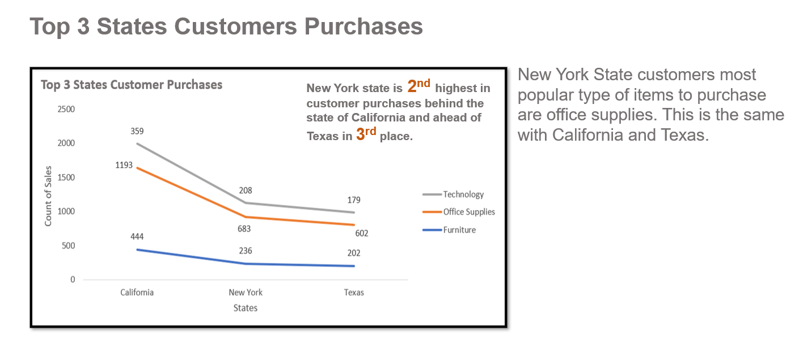

# MegastoreSales
## Megastore Sales Dashboard 
 

### Megastore sales interactive dashboard where you can filter segments e.g. consumer, corporate or home office. You can also filter by ship mode to view how customers got their items delivered to them. The ship mode options are first class, same day, second class and standard class.

In this report the focus will on the Megastore company mainly their stores in state of New York. 

I will compare: 

<li>The top performing average sales of the cities in New York state.  
<li>Top 3 States Customers Purchases. 
<li>Top 2 States Discount Amount in each Region.
<li>Two Cities Sub-Category Sales/ Profits these cities will be New York and Los Angeles. 

Software Used: Microsoft Excel

Charts Used: Bar Chart x2, Line Chart and Stacked Column Chart. 

 
  
 
  
 
 
 

